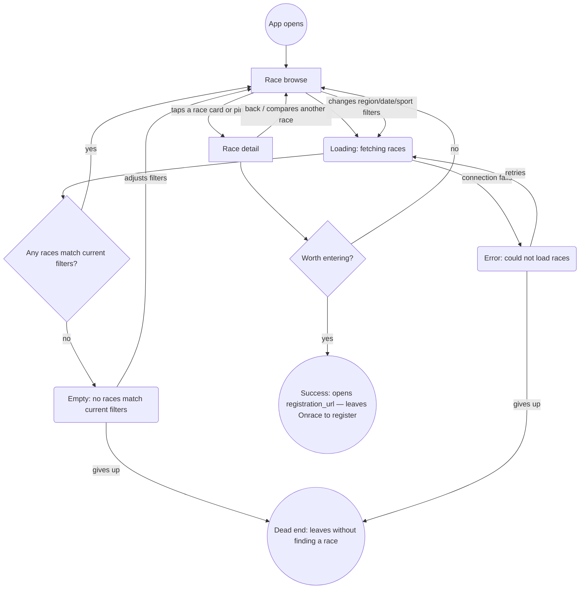
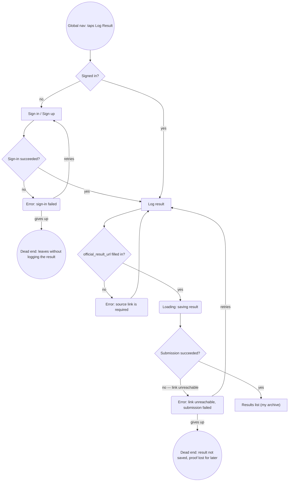
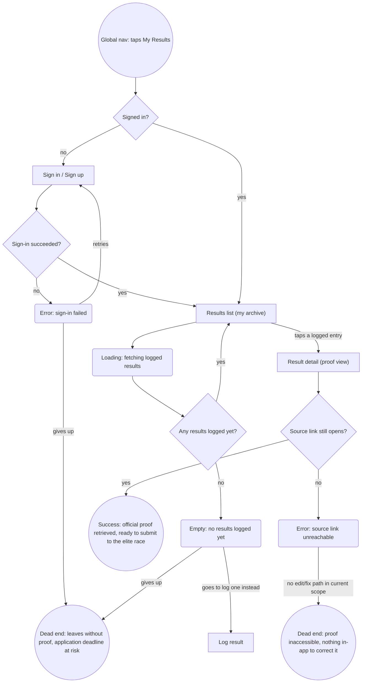

# User flows

Built from `sitemap.md` (Screens + Navigation sections) and `research/jtbd.md`. Every screen node below already exists in `sitemap.md` — no new screen was introduced while drawing these, so nothing needed adding back to the sitemap.

Shape convention, held consistent across all three diagrams:
- `["Screen Name"]` — a screen from `sitemap.md`
- `{"Question?"}` — a decision point
- `("State: ...")` — a loading/empty/error state, not its own screen
- `(("..."))` — a terminal: either a success exit or a dead end

---

## Main Job 1 — Discovery (Primary persona — The HYROX-First Hybrid Athlete)

> "See the full range of options — across countries, formats, and dates — instead of checking each source separately... so that I can compare them in one place." (`jtbd.md`)

**Decisions:**
- *Any races match current filters?* — branches between showing results and the empty state.
- *Worth entering?* — on Race detail, this is where the job's own "so that I can compare them in one place" actually resolves into a decision.

**States:**
- Loading: fetching races.
- Empty: no races match the current filters.
- Error: could not load races (fetch/connection failure).

**Endpoints:**
- **Success:** opens the race's `registration_url` externally and leaves Onrace to register — per `../CLAUDE.md`, Onrace only ever links out, it never handles registration itself.
- **Dead ends:** (1) gives up after an empty-filter result with nothing adjusted; (2) gives up after a fetch error without retrying. Both leave the primary persona without a race, i.e. the job unresolved.

---

## Related Job 3 — Log a Result with Source Proof (Secondary persona — The Qualifying-Time Archivist)

> "When I finish a race, I want to log the result along with where it came from, so that I have proof ready without having to redo the work later." (`jtbd.md`)

**Decisions:**
- *Signed in?* — Log Result is owner-only per `../CLAUDE.md`'s RLS model; gates into Sign in / Sign up if not, per the Navigation section's contextual-gate design.
- *Sign-in succeeded?*
- *official_result_url filled in?* — enforces the required-source-link trust model (`../CLAUDE.md` → Result trust model) before the form can be submitted at all.
- *Submission succeeded?*

**States:**
- Error: sign-in failed.
- Error: source link is required (client-side validation, before submission).
- Loading: saving result.
- Error: link unreachable / submission failed.

**Endpoints:**
- **Success:** the result lands in Results list ("my archive") — the proof is now stored for later retrieval (feeds directly into the next flow below).
- **Dead ends:** (1) gives up during a failed sign-in; (2) gives up after a failed submission. Either way, no proof gets saved — the exact failure mode this job exists to prevent ("proof ready without having to redo the work later").

---

## Related Job 4 — Retrieve Proof for an Elite-Race Application (Secondary persona — The Qualifying-Time Archivist)

> "When an elite race asks me to prove a past result, I want to pull that proof up quickly, so that I can apply without scrambling to find it." (`jtbd.md`)

**Decisions:**
- *Signed in?* — same owner-only gate as the Log Result flow.
- *Sign-in succeeded?*
- *Any results logged yet?* — branches between the archive and an empty state.
- *Source link still opens?* — the moment the "the link is the evidence" trust model (`../CLAUDE.md` → Result trust model) actually gets tested by an outside party.

**States:**
- Error: sign-in failed.
- Loading: fetching logged results.
- Empty: no results logged yet.
- Error: source link unreachable.

**Endpoints:**
- **Success:** proof is retrieved and ready to submit to the elite race. What happens after that — whether the race accepts it — is outside Onrace's scope by design: Onrace's job ends at retrieval, since the product's trust model is "self-reported, source-linked," not "Onrace verifies" (`research.md` → CONCLUSIONS gap 4).
- **Dead ends:** (1) gives up during a failed sign-in, with a real application deadline at risk; (2) has nothing logged yet and gives up instead of switching to Log Result; (3) the source link has rotted and there's no in-app way to fix or replace it — this traces directly to the Navigation section's honest "Deep: none yet" note, since editing a logged result isn't a screen `sitemap.md` defines yet.
