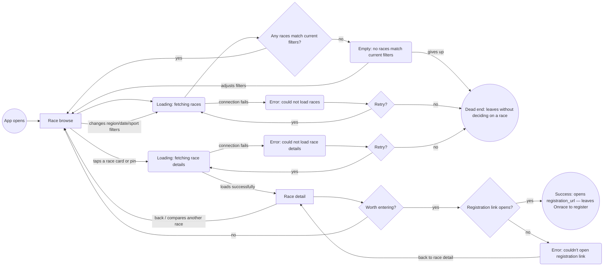
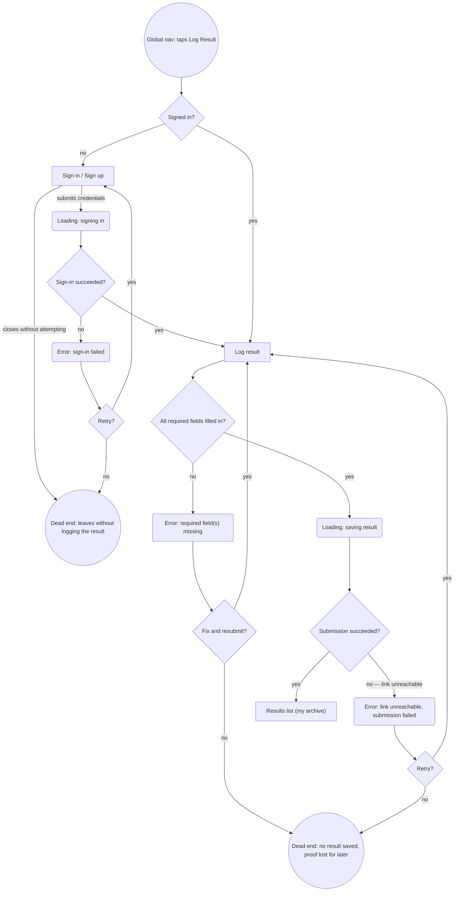
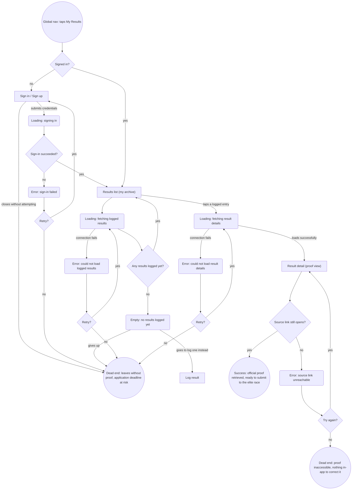

# User flows

Built from `sitemap.md` (Screens + Navigation sections) and `research/jtbd.md`. Every screen node below already exists in `sitemap.md` — no new screen was introduced while drawing these, so nothing needed adding back to the sitemap.

Shape convention, held consistent across all three diagrams:
- `["Screen Name"]` — a screen from `sitemap.md`
- `{"Question?"}` — a decision point
- `("State: ...")` — a loading/empty/error state, not its own screen
- `(("..."))` — a terminal: either a success exit or a dead end

Direction is picked per diagram for legibility, not held fixed at `TD`: Discovery below uses `flowchart LR` because "Race browse" is revisited from six different edges (entry, filter change, two dead-end retries, "back," and the no-branch of the final decision) — top-down forced those into crossing arcs; left-to-right resolves them into a clean horizontal fan with no logic change. Log Result and Retrieve Proof stay `TD` — neither revisits a single node anywhere near that often, so top-down already reads cleanly for them.

## Revision note (detail-level audit)

A pass against a stricter reference pattern found three gaps, now fixed everywhere they applied:

1. **Every genuine error state now offers an explicit retry decision, not just a dead end.** `ValidationError` (Flow 2) previously only looped back to the form with no "gives up" path modeled; `LinkError` (Flow 3) previously dead-ended immediately with no retry attempt, even though a broken link could be a transient failure. Both now branch through an explicit `{"Retry?"}`-style diamond, matching the pattern already used by `FetchError`/`AuthError`/`SubmitError`. Retry/give-up is now modeled as its own diamond decision everywhere, not just as two edges hanging off a rounded state node — this makes "does this error offer a real choice" visually unambiguous.
   - **Not applied to empty states** (`Empty`, `Empty2`): an empty result set isn't a failure to retry, it's a legitimate data state — the honest alternatives are "do something to fix it" (adjust filters / go log a result) or "leave," not "try the same fetch again." Kept as two direct edges, deliberately not a `Retry?` diamond.
2. **Every distinct network-dependent step now has its own loading state**, instead of reusing one generic node or skipping the state entirely: added `DetailLoading` (Flow 1, opening a race), `SigningIn`/`SigningIn2` (Flows 2 and 3, sign-in was previously modeled as instant while form submission wasn't), and `DetailLoading2` (Flow 3, opening a specific logged result). Re-fetching the race list on a filter change still correctly reuses `Loading` — that's the same operation repeating, not a different step being conflated with it.
3. **Dead ends re-examined for genuine distinctness**, not just left as originally drawn:
   - Flow 1's `DeadEnd1` already merged "empty results" and "fetch error" give-ups into one outcome; the new `DetailError`'s give-up path merges into it too, and its label was broadened slightly ("leaves without *deciding on*" rather than "*finding*" a race) so it honestly covers all three causes.
   - Flow 3's new `DetailError2` give-up merges into `DeadEnd4` for the same reason — same downstream outcome ("no proof in hand, deadline at risk"), whatever the internal cause.
   - Kept **separate**, on purpose, after considering the merge: Flow 2's `DeadEnd2` (auth failure) vs. `DeadEnd3` (save failure, now also covering the validation-error give-up) — different root causes with different real fixes (an auth problem vs. a forms/data problem). And Flow 3's `DeadEnd4` (can't reach the archive at all) vs. `DeadEnd5` (reached it, but the evidence itself is dead) — the second is a categorically different, more specific gap (points at the missing edit/re-link feature already flagged in the Navigation section's "Deep: none yet"), not a rewording of the first.

## Revision note (Discovery layout)

The Discovery diagram's top-down layout was visually tangled — arrows crossing around "Race browse," and the three retry/give-up paths converging on one dead-end node from awkward angles. Rendered four candidates (`TD`/`LR` × merged/split dead end) and compared them directly before choosing: switching only the direction to `flowchart LR`, with the dead-end node left exactly as merged, resolved both problems — same nodes, same edges, same single dead-end outcome, just laid out left-to-right instead of top-down. Splitting the dead end into three nodes was rejected even though it also read cleanly, because it would have reversed the merge decision from the audit above for a purely cosmetic reason, duplicating one outcome into three identical-meaning circles.

## Revision note (post-critique fixes, 2026-09-17)

A rigorous critique against this file and `sitemap.md` found further gaps, fixed here:

1. **Flow 3's logged-results fetch (`Loading2`) had no failure branch** — the one network step in the whole document without one. Added `FetchError2`/`Retry?`, mirroring Flow 1's `Loading`/`FetchError` pattern, merging its give-up edge into `DeadEnd4`.
2. **Both auth gates (Flow 2, Flow 3) had no way to back out before attempting sign-in** — the only modeled exits were through a failed attempt. Added a direct "closes without attempting" edge from `SignIn`/`SignIn2` into `DeadEnd2`/`DeadEnd4` respectively.
3. **Flow 2's form validation only checked `official_result_url`**, even though `race_name`, `date`, `sport_type`, and `finish_time` are equally required by `../CLAUDE.md`'s data model. Generalized `HasLink` into `HasRequired` ("All required fields filled in?"), reusing the existing `ValidationError`/`ValidationRetry` pattern rather than adding new nodes.
4. **Flow 1's `registration_url` had no failure handling**, unlike `official_result_url`'s treatment in Flow 3. Added a lightweight, lower-stakes check (`RegLinkCheck` → error → back-edge to Race detail) — deliberately without a `Retry?` diamond, since this is an outbound link to someone else's site, not Onrace's own trust mechanism.
5. **`DeadEnd5`** (source link dead even after retry, Flow 3) **is left as-is by decision** — see the note at that dead end below. Closing it would require an edit/re-link capability not backed by any job in `jtbd.md`; logged as a post-MVP backlog item rather than built speculatively.

---

## Main Job 1 — Discovery (Primary persona — The HYROX-First Hybrid Athlete)

> "See the full range of options — across countries, formats, and dates — instead of checking each source separately... so that I can compare them in one place." (`jtbd.md`)

**Decisions:**
- *Any races match current filters?* — branches between showing results and the empty state.
- *Retry?* (after a race-list fetch fails) — genuine choice between trying the same fetch again or giving up.
- *Retry?* (after a race-detail fetch fails) — same choice, one level down, for opening a specific race.
- *Worth entering?* — on Race detail, this is where the job's own "so that I can compare them in one place" actually resolves into a decision.
- *Registration link opens?* (added — Race detail previously assumed opening `registration_url` always succeeds) — checked at lighter weight than the Retrieve Proof flow's equivalent check on `official_result_url`: no retry diamond, just a direct back-edge to Race detail, since this is an outbound link to someone else's registration page, not Onrace's own trust mechanism.

**States:**
- Loading: fetching races (the list).
- Loading: fetching race details (a single race — its own step, no longer skipped or folded into the list's loading state).
- Empty: no races match the current filters.
- Error: could not load races (list fetch/connection failure).
- Error: could not load race details (detail fetch/connection failure).
- Error: couldn't open registration link (added — lighter-weight than the source-link failure in the Retrieve Proof flow; no retry loop, just a back-edge to Race detail).

**Endpoints:**
- **Success:** opens the race's `registration_url` externally and leaves Onrace to register — per `../CLAUDE.md`, Onrace only ever links out, it never handles registration itself.
- **Dead end:** one merged outcome — "leaves without deciding on a race" — reachable from three different causes (gives up on an empty result, gives up after a failed list fetch, gives up after a failed detail fetch). All three leave the primary persona in the same place: no race decided on, job unresolved. Kept as a single node rather than three, since the *cause* is already visible from which edge leads in, and the *outcome* genuinely doesn't differ.

---

## Related Job 3 — Log a Result with Source Proof (Secondary persona — The Qualifying-Time Archivist)

> "When I finish a race, I want to log the result along with where it came from, so that I have proof ready without having to redo the work later." (`jtbd.md`)

**Decisions:**
- *Signed in?* — Log Result is owner-only per `../CLAUDE.md`'s RLS model; gates into Sign in / Sign up if not, per the Navigation section's contextual-gate design.
- *Sign-in succeeded?*
- *Retry?* (after a failed sign-in) — previously just an edge label; now an explicit diamond, same as every other error in this flow.
- *All required fields filled in?* (generalized from *official_result_url filled in?*) — checks every required field on `results` per `../CLAUDE.md`'s data model (race_name, date, sport_type, finish_time, official_result_url), not just the source link in isolation. The source link's requiredness is still the trust-model-critical one (`../CLAUDE.md` → Result trust model), but the other fields are just as required by the schema and previously had no modeled validation at all — a blank `finish_time` would have silently surfaced as "link unreachable" via `SubmitError`, which was never accurate.
- *Fix and resubmit?* (after a required-fields validation failure) — previously this error only looped back to the form with no give-up path at all; now it's a real choice, same as the other two errors in this flow.
- *Submission succeeded?*
- *Retry?* (after a failed submission)

**States:**
- Loading: signing in (previously missing — sign-in was drawn as instant even though form submission, an equivalent network call, already had its own loading state).
- Error: sign-in failed.
- Error: required field(s) missing (client-side validation, before submission — covers race_name, date, sport_type, finish_time, and official_result_url; generalized from checking only the source link).
- Loading: saving result.
- Error: link unreachable / submission failed.

**Endpoints:**
- **Success:** the result lands in Results list ("my archive") — the proof is now stored for later retrieval (feeds directly into the next flow below).
- **Dead ends:** two, kept distinct on purpose.
  - *Leaves without logging the result* — reachable from a failed sign-in (after exhausting retries) or from closing the Sign in / Sign up screen without attempting at all (added — previously the only modeled exit from that screen was through a failed attempt). Root cause: never got signed in.
  - *No result saved, proof lost for later* — reachable from either the required-fields validation failing or the save itself failing. Root cause: a forms/data problem, once already past sign-in. These two were considered for merging into one "nothing happened" dead end but kept apart because they point at different real fixes (fix auth vs. fix the submission path), unlike the validation/submission pair inside the second node, which really is the same failure surfaced at two different moments.

---

## Related Job 4 — Retrieve Proof for an Elite-Race Application (Secondary persona — The Qualifying-Time Archivist)

> "When an elite race asks me to prove a past result, I want to pull that proof up quickly, so that I can apply without scrambling to find it." (`jtbd.md`)

**Decisions:**
- *Signed in?* — same owner-only gate as the Log Result flow.
- *Sign-in succeeded?*
- *Retry?* (after a failed sign-in)
- *Retry?* (after a failed fetch of the logged-results list — added; this was the one network fetch in the whole document that previously had no paired failure branch, unlike every other fetch here).
- *Any results logged yet?* — branches between the archive and an empty state.
- *Retry?* (after a failed fetch of a specific result's details — previously this step wasn't modeled at all; opening a result was drawn as instant).
- *Source link still opens?* — the moment the "the link is the evidence" trust model (`../CLAUDE.md` → Result trust model) actually gets tested by an outside party.
- *Try again?* (after the source link fails to open) — previously this dead-ended immediately with no retry attempt, even though the failure could be transient (a flaky timing-site server, not necessarily a truly dead link).

**States:**
- Loading: signing in (previously missing, same gap as Flow 2).
- Error: sign-in failed.
- Loading: fetching logged results.
- Error: could not load logged results (added — previously this fetch had no failure branch at all, unlike every other fetch in this document).
- Empty: no results logged yet.
- Loading: fetching result details (previously missing — a specific result's detail fetch was collapsed into an instant transition).
- Error: could not load result details.
- Error: source link unreachable.

**Endpoints:**
- **Success:** proof is retrieved and ready to submit to the elite race. What happens after that — whether the race accepts it — is outside Onrace's scope by design: Onrace's job ends at retrieval, since the product's trust model is "self-reported, source-linked," not "Onrace verifies" (`research.md` → CONCLUSIONS gap 4).
- **Dead ends:** two, kept distinct on purpose.
  - *Leaves without proof, application deadline at risk* — one merged outcome reachable from five causes: a failed sign-in, closing the Sign in / Sign up screen without attempting at all (added), an empty archive (nothing was ever logged), a failed fetch of the logged-results list (added), or a failed fetch of a specific result's details. All five share the same downstream reality — no proof in hand, right when it's needed — so they're one node, not five.
  - *Proof inaccessible, nothing in-app to correct it* — kept separate from the node above on purpose. This one is reached only after everything else worked (signed in, archive has entries, the specific result loaded fine) and the source link itself turns out to be dead even after a retry. That's a materially different, more specific problem — the evidence itself has rotted — pointing at a real, currently-missing product gap (an edit/re-link flow for a logged result), which ties directly to the Navigation section's honest "Deep: none yet" note.
    - **Decision (2026-09-17): left as a known, accepted MVP gap.** Closing it (an edit/re-link capability for a logged result) would be new scope not backed by any job in `jtbd.md` — no job asks to *correct* a logged result, only to log one (Related Job 3) and retrieve one (Related Job 4). Tracked here as a post-MVP backlog item rather than built speculatively; revisit if a "fix a stale result" job is ever sourced.
