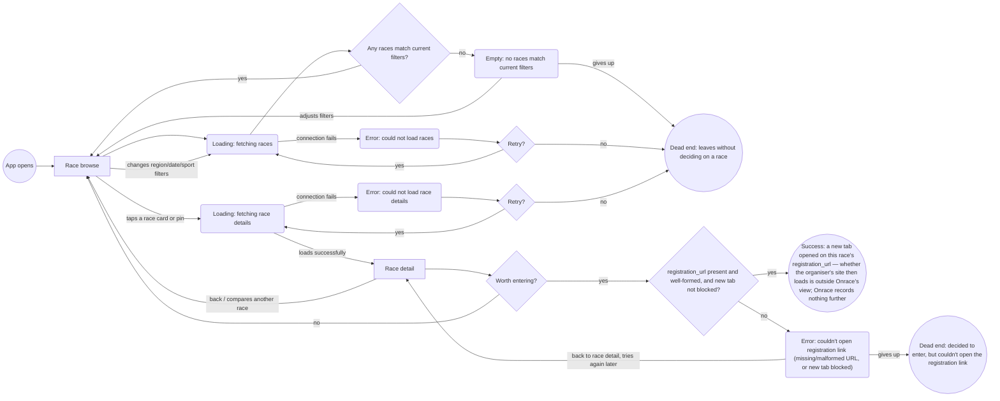
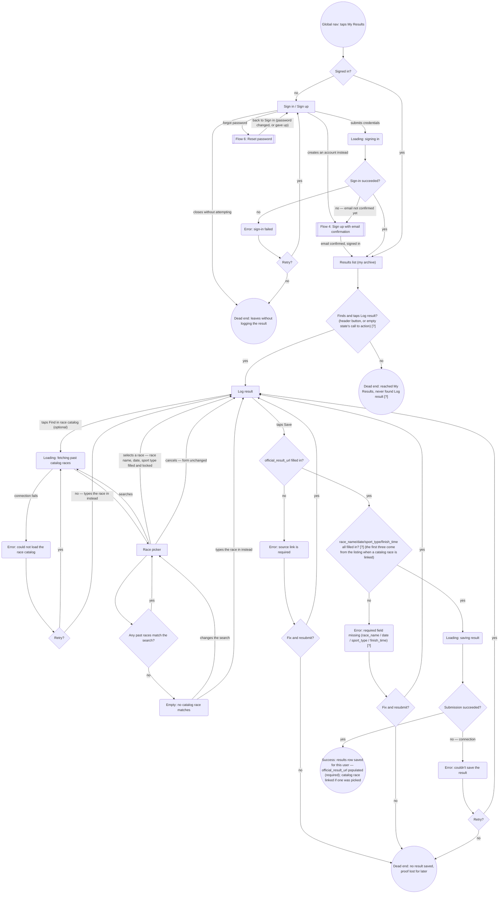
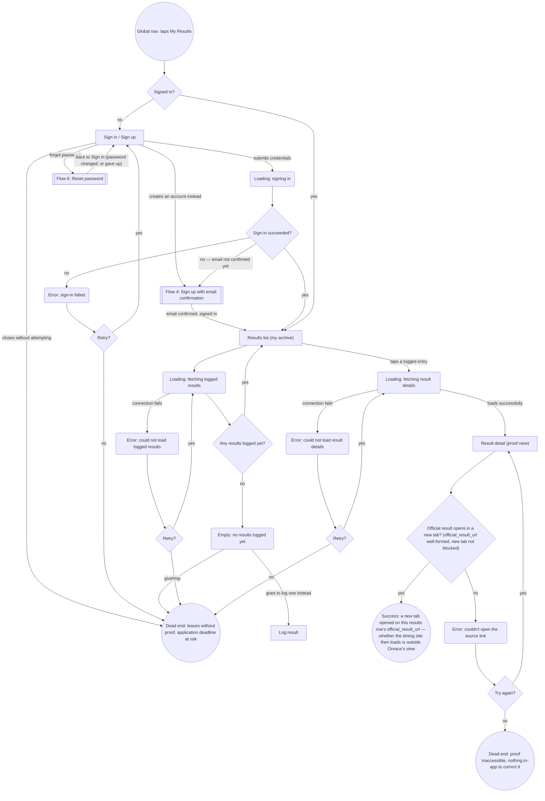
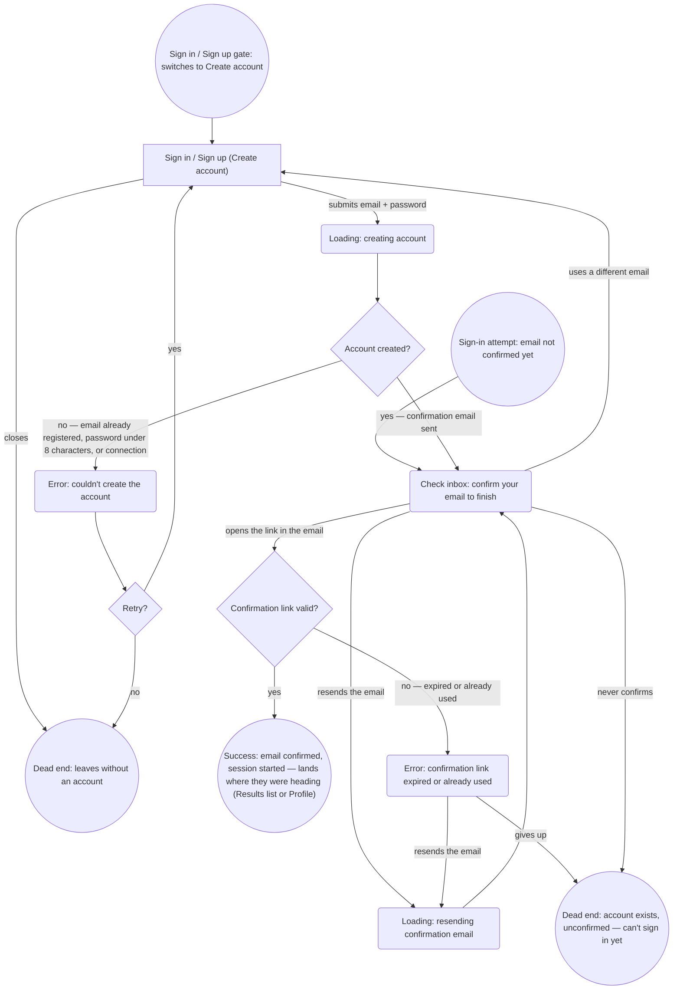
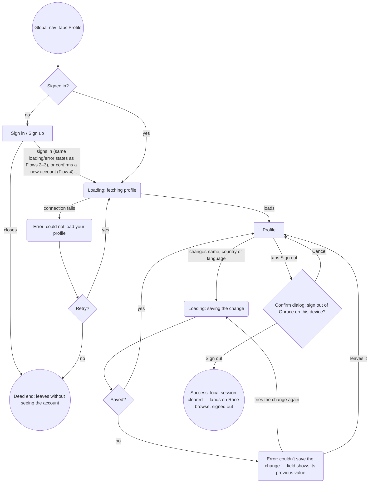
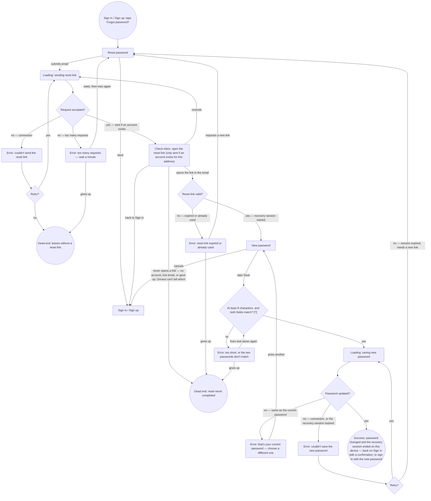

# User flows

Built from `sitemap.md` (Screens + Navigation sections) and `research/jtbd.md`. Every screen node below exists in `sitemap.md`. Screens added back to the sitemap while drawing: **Race picker** (2026-09-25, Flow 2's catalog branch), and **Reset password** and **New password** (2026-09-25, Flow 6). That follows the working method's rule that a flow may only use screens the sitemap names.

Shape convention, held consistent across all six diagrams:
- `["Screen Name"]` — a screen from `sitemap.md`
- `{"Question?"}` — a decision point
- `("State: ...")` — a loading/empty/error state, not its own screen
- `(("..."))` — a terminal: either a success exit or a dead end
- `[["..."]]` — a whole other flow in this document, drawn once and referenced, not redrawn (added 2026-09-25 for the sign-up flow, which both archive flows pass through)

Direction is picked per diagram for legibility, not held fixed at `TD`: Discovery below uses `flowchart LR` because "Race browse" is revisited from six different edges (entry, filter change, two dead-end retries, "back," and the no-branch of the final decision) — top-down forced those into crossing arcs; left-to-right resolves them into a clean horizontal fan with no logic change. Log Result and Retrieve Proof stay `TD` — neither revisits a single node anywhere near that often, so top-down already reads cleanly for them.

## Revision note (detail-level audit)

A pass against a stricter reference pattern found three gaps, now fixed everywhere they applied:

1. **Every genuine error state now offers an explicit retry decision, not just a dead end.** `ValidationError` (Flow 2) previously only looped back to the form with no "gives up" path modeled; `LinkError` (Flow 3) previously dead-ended immediately with no retry attempt, even though a broken link could be a transient failure. Both now branch through an explicit `{"Retry?"}`-style diamond, matching the pattern already used by `FetchError`/`AuthError`/`SubmitError`. Retry/give-up is now modeled as its own diamond decision everywhere, not just as two edges hanging off a rounded state node — this makes "does this error offer a real choice" visually unambiguous.
   - **Not applied to empty states** (`Empty`, `Empty2`): an empty result set isn't a failure to retry, it's a legitimate data state — the honest alternatives are "do something to fix it" (adjust filters / go log a result) or "leave," not "try the same fetch again." Kept as two direct edges, deliberately not a `Retry?` diamond.
2. **Every distinct network-dependent step now has its own loading state**, instead of reusing one generic node or skipping the state entirely: added `DetailLoading` (Flow 1, opening a race), `SigningIn`/`SigningIn2` (Flows 2 and 3, sign-in was previously modeled as instant while form submission wasn't), and `DetailLoading2` (Flow 3, opening a specific logged result). Re-fetching the race list on a filter change still correctly reuses `Loading` — that's the same operation repeating, not a different step being conflated with it.
3. **Dead ends re-examined for genuine distinctness**, not just left as originally drawn:
   - Flow 1's `DeadEnd1` already merged "empty results" and "fetch error" give-ups into one outcome; the new `DetailError`'s give-up path merges into it too, and its label was broadened slightly ("leaves without *deciding on*" rather than "*finding*" a race) so it honestly covers all three causes.
   - Flow 3's new `DetailError2` give-up merges into `DeadEnd4` for the same reason — same downstream outcome ("no proof in hand, deadline at risk"), whatever the internal cause.
   - Kept **separate**, on purpose, after considering the merge: Flow 2's `DeadEnd2` (auth failure) vs. `DeadEnd3` (save failure, now also covering the validation-error give-up) — different root causes with different real fixes (an auth problem vs. a forms/data problem). And Flow 3's `DeadEnd4` (can't reach the archive at all) vs. `DeadEnd5` (reached it, but the evidence itself is dead) — the second is a categorically different, more specific gap (points at the missing edit/re-link feature already flagged in the Navigation section's "Deep: none yet"), not a rewording of the first.

## Revision note (Discovery layout)

The Discovery diagram's top-down layout was visually tangled — arrows crossing around "Race browse," and the three retry/give-up paths converging on one dead-end node from awkward angles. Rendered four candidates (`TD`/`LR` × merged/split dead end) and compared them directly before choosing: switching only the direction to `flowchart LR`, with the dead-end node left exactly as merged, resolved both problems — same nodes, same edges, same single dead-end outcome, just laid out left-to-right instead of top-down. Splitting the dead end into three nodes was rejected even though it also read cleanly, because it would have reversed the merge decision from the audit above for a purely cosmetic reason, duplicating one outcome into three identical-meaning circles.

## Revision note (post-critique fixes, 2026-09-17)

A rigorous critique against this file and `sitemap.md` found further gaps, fixed here:

1. **Flow 3's logged-results fetch (`Loading2`) had no failure branch** — the one network step in the whole document without one. Added `FetchError2`/`Retry?`, mirroring Flow 1's `Loading`/`FetchError` pattern, merging its give-up edge into `DeadEnd4`.
2. **Both auth gates (Flow 2, Flow 3) had no way to back out before attempting sign-in** — the only modeled exits were through a failed attempt. Added a direct "closes without attempting" edge from `SignIn`/`SignIn2` into `DeadEnd2`/`DeadEnd4` respectively.
3. **Flow 2's form validation only checked `official_result_url`**, even though `race_name`, `date`, `sport_type`, and `finish_time` are equally required by `../CLAUDE.md`'s data model. Generalized `HasLink` into `HasRequired` ("All required fields filled in?"), reusing the existing `ValidationError`/`ValidationRetry` pattern rather than adding new nodes.
4. **Flow 1's `registration_url` had no failure handling**, unlike `official_result_url`'s treatment in Flow 3. Added a lightweight, lower-stakes check (`RegLinkCheck` → error → back-edge to Race detail) — deliberately without a `Retry?` diamond, since this is an outbound link to someone else's site, not Onrace's own trust mechanism.
5. **`DeadEnd5`** (source link dead even after retry, Flow 3) **is left as-is by decision** — see the note at that dead end below. Closing it would require an edit/re-link capability not backed by any job in `jtbd.md`; logged as a post-MVP backlog item rather than built speculatively.

## Revision note (fresh-session corrections, 2026-09-17)

A fresh-session review of the prior pass's *reasoning*, not just its diagrams, caught two mischaracterizations:

1. **`registration_url`'s lighter treatment was justified on the wrong grounds.** The prior note framed it as "not Onrace's own trust mechanism" — true, but not the actual reason for lighter handling. The real reason is data provenance: `registration_url` is Onrace's own curated, manually-seeded catalog data (`../CLAUDE.md` → Race data), so it's low rot risk; `official_result_url` is an arbitrary user-submitted link, high rot risk. Reasoning corrected in Flow 1's notes below. Separately, the broken-registration-link give-up path now has its own distinct terminal, `DeadEnd6`, rather than any risk of reading as the same outcome as `DeadEnd1` — this person already decided the race was worth entering; the failure is an external link rotting *after* that decision, not indecision, and merging the two would misrepresent what happened.
2. **Flow 2's required-field check over-generalized.** The prior pass folded `official_result_url` and `race_name`/`date`/`sport_type`/`finish_time` into one "all required fields filled in?" check with one generic error label. That flattened a real distinction: `../CLAUDE.md`'s data model only explicitly marks `official_result_url` as required — the other fields are just listed, not stated as required. Split back into two checks: the original source-link check (unflagged, since it's actually sourced) and a second, explicitly `[?]`-flagged check for the other fields, each with its own specific error label instead of one generic "required fields missing" message.

(A third correction — relocating rather than deleting the "Onrace — entry" screen's underlying rationale — applies to `sitemap.md` only; see that file's Navigation § 1.)

## Revision note (success-endpoint precision, 2026-09-17)

Audited every flow's `Success` endpoint against one question: is it a verifiable condition, or a vague destination like "lands on X screen"? Found two gaps and one asymmetry worth stating outright:

1. **Flow 2 (Log Result) had no `Success` terminal at all** — `SubmitOK`'s "yes" edge just landed on the `ResultsList` screen node, exactly the "lands on X screen" vagueness this check was looking for. Added an explicit `Success2` terminal stating the actual condition: a `results` row now exists for this user with `official_result_url` populated (the one field `../CLAUDE.md` requires), plus the other fields per this flow's `[?]`-flagged check.
2. **Flow 3 (Retrieve Proof)'s `Success3` said "ready to submit to the elite race"** — not verifiable by Onrace, since whether a given application accepts the proof isn't knowable here. Tightened to the condition the flow actually confirms: this specific row's `official_result_url` opened successfully just now.
3. **Flow 1 (Discovery)'s `Success` was already reasonably specific** (names the exact field, `registration_url`), but its prose now says explicitly what it lacks compared to the other two: an Onrace-side data-model record. Opening `registration_url` changes nothing in Onrace's own data — completion happens entirely on an external site, outside Onrace's visibility, unlike the other two endpoints, which are both about a `results` row's confirmed state.

---
## Revision note (Flow 2 entry point, 2026-09-24)

Global navigation went from 3 tabs to 2 (`sitemap.md` → Navigation § 1, revised 2026-09-24): **Log result** is no longer a tab, it's the primary action button inside My Results. Flow 2 now reflects that; everything from the Log result form onward is unchanged.

1. **Entry moved:** `Start2` is now "Global nav: taps My Results," not "taps Log Result." The sign-in gate (`AuthCheck` and everything under it) is unchanged, but it now fires on the My Results tab, and a successful sign-in lands on **Results list**, not directly on the form.
2. **One new step, `ResultsList` → `FindsAction`:** reaching the form now takes a tap on the in-page **Log result** action (header button, or the empty state's call to action). Flagged `[?]`, because it rests on `sitemap.md`'s own unvalidated hypothesis that people will look for logging inside My Results.
3. **One new dead end, `DeadEnd7`** ("reached My Results, never found Log result") `[?]`. Kept separate from `DeadEnd2` (never got signed in) and `DeadEnd3` (forms/data failure) under this document's own rule of merging dead ends only when the root cause and fix are the same. The root cause here is how easy the action is to find, and the fix is prominence/placement in the UI — neither auth nor submission.
4. **Deliberately not added:** the Results list's own fetch (`Loading2` / `FetchError2`) is not copied into Flow 2. That fetch is Flow 3's job. The Log result action is part of the screen's header, not of the loaded list, so it must stay usable while the list is loading or has failed. That's a design constraint on Results list, recorded here so Flow 2 doesn't inherit Flow 3's fetch failure.

---
## Revision note (registration-link check, 2026-09-24)

Building `wireframes/race-detail-error.html` showed that Flow 1's registration-link check asked something a browser can't answer. Onrace is a static web app: when it opens `registration_url` in a new tab, it can't see whether the organiser's site then loads — that happens in another tab, on another site. So the old question, "Registration link opens?", assumed a check that can't exist.

1. **Decision reworded to what the browser can actually check:** `RegLinkCheck` is now "`registration_url` present and well-formed, and new tab not blocked?". Those are the only failures Onrace can detect: the field is empty or isn't a valid URL (a data problem in the curated catalog), or the browser blocked the new tab (e.g. `window.open` returns nothing).
2. **Success tightened to match:** Success is now "a new tab opened on this race's `registration_url`". Whether the organiser's site then loads is outside Onrace's view. That isn't a new node: Onrace can't observe it, so it doesn't belong in Onrace's flow.
3. **Error and dead end relabeled:** `RegLinkError` names its two real causes. `DeadEnd6` changed from "the registration link is broken" to "couldn't open the registration link": Onrace can't know the link is *broken*, only that it couldn't open it.
4. **Unchanged:** the branch structure (two direct edges, no `Retry?` diamond), the data-provenance reasoning for that lighter weight, and `DeadEnd6` staying separate from `DeadEnd1`. The new wording supports the lighter weight: a missing or malformed URL is fixed in the catalog data, not by retrying.

---
## Revision note (catalog link, email confirmation, sign-out, honest link checks; 2026-09-25)

1. **Flow 2 gets the catalog branch.** Log result can now optionally link a race from Onrace's catalog (`sitemap.md` → Entities → 3, "optional link to a Race listing", which was never wired up). A new screen, **Race picker**, searches the catalog's *past* races. It has its own loading, empty (no match) and error states. Picking a race fills race name, date and sport type from the listing and locks them; cancelling or giving up returns to the form with nothing changed, where the race can still be typed in by hand. So the catalog is a shortcut, never a requirement.
2. **Sign-up is its own flow (Flow 4), with email confirmation.** Onrace uses Supabase Auth's email + password with **Confirm email** left on (its default): after "Create account" nobody is signed in yet. They get a "check your inbox" step, and only opening the emailed link signs them in. Flows 2 and 3 reference Flow 4 (`[[...]]`) from their Sign in / Sign up node instead of redrawing it. Signing in with an unconfirmed email also routes to "check your inbox" (Supabase's "Email not confirmed" error).
3. **Profile and sign-out get a flow (Flow 5).** It covers fetching the profile (loading and error), saving a changed field (it saves as it changes, and can fail), and sign-out behind a confirm dialog. Sign-out has no loading or error branch on purpose: it signs out *this device* (Supabase `signOut({ scope: 'local' })`), which clears the local session without a network call and so can't fail.
4. **Link checks say only what a browser can know.** Flow 3's "Source link still opens?" is now "Official result opens in a new tab?" (well-formed URL, new tab not blocked), the same rewording Flow 1 got on 2026-09-24. `LinkError` is now "couldn't open the source link". Flow 2's `SubmitError` was "link unreachable": Onrace's stack is client-side only (no custom server, `../CLAUDE.md`), so it can't fetch arbitrary timing sites to check them. It's now "couldn't save the result".

---
## Revision note (password reset, 2026-09-25)

Email + password sign-in needs a way back in for someone who forgot the password. `sitemap.md` → Entities → 5 had flagged it as the next infrastructure gap, and **Flow 6** closes it. Two new screens, **Reset password** (ask for a link) and **New password** (set one), are both reached from Sign in, never from the tab bar. Flows 2 and 3 gain one edge each from their Sign in / Sign up node ("forgot password" → `[[Flow 6]]`), and Flow 4 is unchanged.

What Onrace can and can't observe, stated the same way as the registration-link check (2026-09-24):
- **It can know** whether Supabase accepted the reset request. Supabase answers "sent" whether or not an account exists for that address, so nobody can use the form to learn who has an account.
- **It can't know** whether an email arrived, whether an account exists, or whether the person ever opens the link. Those happen in someone's inbox. So Check inbox says "if an account exists…", and a request that never turns into a new password is a dead end Onrace can't see (`DeadEnd12`).
- **It can know again** once the link is opened, because the app opens with it: whether the link is still valid, and whether the new password saved.

---

## Main Job 1 — Discovery (Primary persona — The HYROX-First Hybrid Athlete)

> "See the full range of options — across countries, formats, and dates — instead of checking each source separately... so that I can compare them in one place." (`jtbd.md`)

**Decisions:**
- *Any races match current filters?* — branches between showing results and the empty state.
- *Retry?* (after a race-list fetch fails) — genuine choice between trying the same fetch again or giving up.
- *Retry?* (after a race-detail fetch fails) — same choice, one level down, for opening a specific race.
- *Worth entering?* — on Race detail, this is where the job's own "so that I can compare them in one place" actually resolves into a decision.
- *`registration_url` present and well-formed, and new tab not blocked?* (originally "Registration link opens?"; reworded 2026-09-24 to what a browser can actually verify — see the revision note above. Onrace can't see whether the organiser's site loads in the new tab, only whether the link was usable and the tab opened) — checked at lighter weight than the Retrieve Proof flow's equivalent check on `official_result_url`: no retry diamond, just two direct edges (mirroring how `Empty`/`Empty2` are already handled elsewhere in this document — a legitimate outcome gets two edges, not a formal retry loop). The lighter weight is about data provenance, not job/trust-mechanism importance: `registration_url` is Onrace's own curated, manually-seeded catalog data (`../CLAUDE.md` → Race data: "manually curated/seeded, no scraping in MVP"), so Onrace controls when it's entered and it's low rot risk. `official_result_url` is an arbitrary link a user pastes in themselves, with no curation at all — genuinely higher rot risk, which is why it gets the heavier, retry-capable treatment in Flow 3.

**States:**
- Loading: fetching races (the list).
- Loading: fetching race details (a single race — its own step, no longer skipped or folded into the list's loading state).
- Empty: no races match the current filters.
- Error: could not load races (list fetch/connection failure).
- Error: could not load race details (detail fetch/connection failure).
- Error: couldn't open registration link — a missing/malformed `registration_url`, or the new tab being blocked (the only failures a browser can detect; added — lighter-weight than the source-link failure in the Retrieve Proof flow, per the data-provenance reasoning above; no retry loop — a direct back-edge to Race detail, or a distinct give-up outcome, `DeadEnd6`, kept separate from `DeadEnd1`).

**Endpoints:**
- **Success:** a new tab has opened on the race's `registration_url` — that's the entire condition, and all Onrace can verify (revised 2026-09-24: whether the organiser's site then loads happens in another tab, outside Onrace's view). Per `../CLAUDE.md`, Onrace only ever links out, never handles registration, so no Onrace-side record (no row, no flag, nothing in the data model) is created or changed by this. Unlike the other two flows' success endpoints, this one isn't verifiable from Onrace's own data — the job's completion happens entirely on the registration site, outside Onrace's visibility.
- **Dead ends:** two, kept distinct on purpose.
  - *Leaves without deciding on a race* (`DeadEnd1`) — one merged outcome reachable from three different causes (gives up on an empty result, gives up after a failed list fetch, gives up after a failed detail fetch). All three leave the primary persona in the same place: no race decided on, job unresolved. Kept as a single node rather than three, since the *cause* is already visible from which edge leads in, and the *outcome* genuinely doesn't differ.
  - *Decided to enter, but couldn't open the registration link* (`DeadEnd6`; was "...the registration link is broken" until 2026-09-24 — Onrace can only know the link couldn't be opened, not that it's broken) — kept separate from `DeadEnd1` on purpose, even though both are give-up outcomes. This person already made the decision the job's own "so that I can compare them in one place" resolves into — the failure here is an unusable or blocked registration link discovered *after* deciding, not indecision or an earlier fetch failure. Folding it into `DeadEnd1` would misrepresent what actually happened.

---

## Related Job 3 — Log a Result with Source Proof (Secondary persona — The Qualifying-Time Archivist)

> "When I finish a race, I want to log the result along with where it came from, so that I have proof ready without having to redo the work later." (`jtbd.md`)

**Decisions:**
- *Signed in?* — Logged results are owner-only per `../CLAUDE.md`'s RLS model, so the My Results tab gates into Sign in / Sign up if not signed in, per the Navigation section's contextual-gate design. Since 2026-09-24 this gate sits on the My Results tab rather than on a Log Result tab; Log result lives inside My Results, so one gate covers both archive jobs. Since 2026-09-25 the same gate is also reached from the Profile tab (3-tab bar, `sitemap.md` → Navigation § 1). That path lands on Profile, not Results list, and isn't part of this flow.
- *Sign-in succeeded?* has a third edge since 2026-09-25: "no — email not confirmed yet" routes into Flow 4's check-your-inbox step, not to the generic sign-in error. That's Supabase's distinct "Email not confirmed" response, and "try again" can't fix it: confirming the email can.
- *Finds and taps Log result?* `[?]` — added 2026-09-24 with the 2-tab nav. The form is now one in-page action away from Results list (header button, or the empty state's call to action), not a tab. Flagged: that people look for logging inside My Results is `sitemap.md` → Navigation § 1's unvalidated hypothesis. The action must not depend on the list having loaded (see the 2026-09-24 revision note).
- *Retry?* (after a failed sign-in) — previously just an edge label; now an explicit diamond, same as every other error in this flow.
- *official_result_url filled in?* — enforces the required-source-link trust model (`../CLAUDE.md` → Result trust model) before the form can be submitted at all. This is the one field `../CLAUDE.md`'s data model explicitly marks "(required)."
- *race_name/date/sport_type/finish_time all filled in?* `[?]` — added as a second, separate check, deliberately flagged. Unlike `official_result_url`, `../CLAUDE.md`'s data model doesn't actually say these fields are required — it just lists them (`race_name/date/sport_type ..., finish_time, official_result_url (required)`). Modeled here as an assumed requirement (a result with no finish time or date is hard to imagine as useful) and flagged `[?]`, per this document set's own convention for assumed-not-sourced parts (see `sitemap.md`'s Entities section), not presented as settled fact. Previously this had no modeled validation at all — a blank `finish_time` would have silently surfaced as "link unreachable" via `SubmitError`, which was never accurate.
- *Fix and resubmit?* (after the source-link validation fails) — previously this error only looped back to the form with no give-up path at all; now it's a real choice, same as the other errors in this flow.
- *Fix and resubmit?* (after the other-required-fields validation fails) `[?]` — same retry-or-give-up choice, one level down; inherits the same `[?]` status as the check above it.
- *Submission succeeded?*
- *Retry?* (after a failed submission)
- *Any past races match the search?* (Race picker, added 2026-09-25) — the picker searches only races whose `event_date` has passed. You log a result for a race you've run, so upcoming races are never offered. No match isn't an error. Its exits are changing the search or typing the race in by hand.
- *Retry?* (after the catalog fails to load) — "no" isn't a dead end: the form still works without a catalog link, so giving up on the picker means typing the race in.

**States:**
- Loading: signing in (previously missing — sign-in was drawn as instant even though form submission, an equivalent network call, already had its own loading state).
- Error: sign-in failed.
- Error: source link is required (client-side validation, before submission).
- Error: required field missing (race_name / date / sport_type / finish_time) `[?]` (client-side validation, before submission — flagged, since these aren't explicitly marked required in `../CLAUDE.md`'s data model the way `official_result_url` is).
- Loading: saving result.
- Error: couldn't save the result (was "link unreachable / submission failed" until 2026-09-25: a client-side app can't check that an arbitrary timing site is reachable, so it can only know the save failed).
- Loading: fetching past catalog races (Race picker, on opening it and on each search).
- Empty: no catalog race matches (Race picker).
- Error: could not load the race catalog (Race picker).

**Endpoints:**
- **Success:** tightened from "lands in Results list" (a screen, not a condition) to the actual verifiable state: a new row now exists in `results`, owned by this user via RLS, with `official_result_url` populated — the one field `../CLAUDE.md`'s data model explicitly requires — and, per this flow's `[?]`-flagged validation, `race_name`, `date`, `sport_type`, and `finish_time` populated too (though that requirement is only assumed here, not confirmed at the schema level — see the `[?]` on `HasOtherRequired` above). That row is what now appears on Results list ("my archive") and is what the next flow below retrieves.
- **Dead ends:** three, kept distinct on purpose.
  - *Leaves without logging the result* — reachable from a failed sign-in (after exhausting retries) or from closing the Sign in / Sign up screen without attempting at all (added — previously the only modeled exit from that screen was through a failed attempt). Root cause: never got signed in.
  - *No result saved, proof lost for later* — reachable from the source-link validation failing, the other-required-fields validation failing `[?]`, or the save itself failing. Root cause: a forms/data problem, once already past sign-in. These two were considered for merging into one "nothing happened" dead end but kept apart because they point at different real fixes (fix auth vs. fix the submission path), unlike the validation/submission pair inside the second node, which really is the same failure surfaced at two different moments.
  - *Reached My Results, never found Log result* `[?]` (added 2026-09-24) — signed in fine, on the right screen, but never took the in-page action. Root cause: the action wasn't findable enough. Real fix: its placement/prominence on Results list. That's a different fix from both dead ends above, so it isn't merged into either. Flagged because whether this happens at all is untested.

---

## Related Job 4 — Retrieve Proof for an Elite-Race Application (Secondary persona — The Qualifying-Time Archivist)

> "When an elite race asks me to prove a past result, I want to pull that proof up quickly, so that I can apply without scrambling to find it." (`jtbd.md`)

**Decisions:**
- *Signed in?* — same owner-only gate as the Log Result flow.
- *Sign-in succeeded?*
- *Retry?* (after a failed sign-in)
- *Retry?* (after a failed fetch of the logged-results list — added; this was the one network fetch in the whole document that previously had no paired failure branch, unlike every other fetch here).
- *Any results logged yet?* — branches between the archive and an empty state.
- *Retry?* (after a failed fetch of a specific result's details — previously this step wasn't modeled at all; opening a result was drawn as instant).
- *Official result opens in a new tab?* (was "Source link still opens?" until 2026-09-25) — the moment the "the link is the evidence" trust model (`../CLAUDE.md` → Result trust model) gets used. Reworded, like Flow 1's registration check, to what a browser can verify: the URL is well-formed and the new tab wasn't blocked. Whether the timing site then loads happens in that other tab, outside Onrace's view, so the error copy must not claim the site is down.
- *Try again?* (after the source link fails to open) — previously this dead-ended immediately with no retry attempt, even though the failure could be transient (a flaky timing-site server, not necessarily a truly dead link).

**States:**
- Loading: signing in (previously missing, same gap as Flow 2).
- Error: sign-in failed.
- Loading: fetching logged results.
- Error: could not load logged results (added — previously this fetch had no failure branch at all, unlike every other fetch in this document).
- Empty: no results logged yet.
- Loading: fetching result details (previously missing — a specific result's detail fetch was collapsed into an instant transition).
- Error: could not load result details.
- Error: couldn't open the source link (was "source link unreachable" until 2026-09-25; see the decision above).

**Endpoints:**
- **Success:** tightened from "ready to submit to the elite race" — not something Onrace can actually verify, since whether a specific application accepts the proof isn't knowable from here — to the condition the flow itself confirms: the selected `results` row's `official_result_url`, the required proof link per `../CLAUDE.md`'s Result trust model, opened successfully in this session. What happens after that — whether the race accepts it — is outside Onrace's scope by design: Onrace's job ends at confirming the link is live, since the product's trust model is "self-reported, source-linked," not "Onrace verifies" (`research.md` → CONCLUSIONS gap 4).
- **Dead ends:** two, kept distinct on purpose.
  - *Leaves without proof, application deadline at risk* — one merged outcome reachable from five causes: a failed sign-in, closing the Sign in / Sign up screen without attempting at all (added), an empty archive (nothing was ever logged), a failed fetch of the logged-results list (added), or a failed fetch of a specific result's details. All five share the same downstream reality — no proof in hand, right when it's needed — so they're one node, not five.
  - *Proof inaccessible, nothing in-app to correct it* — kept separate from the node above on purpose. This one is reached only after everything else worked (signed in, archive has entries, the specific result loaded fine) and the source link itself turns out to be dead even after a retry. That's a materially different, more specific problem — the evidence itself has rotted — pointing at a real, currently-missing product gap (an edit/re-link flow for a logged result), which ties directly to the Navigation section's honest "Deep: none yet" note.
    - **Decision (2026-09-17): left as a known, accepted MVP gap.** Closing it (an edit/re-link capability for a logged result) would be new scope not backed by any job in `jtbd.md` — no job asks to *correct* a logged result, only to log one (Related Job 3) and retrieve one (Related Job 4). Tracked here as a post-MVP backlog item rather than built speculatively; revisit if a "fix a stale result" job is ever sourced.

---

## Flow 4 — Sign up with email confirmation (infrastructure; both personas)

Not a job flow. It exists because accounts do (`sitemap.md` → Entities → 5). It's drawn once, here, and referenced from Flows 2 and 3 (`[[...]]`). The method is decided (2026-09-25, `sitemap.md` → Entities → 5): **email + password through Supabase Auth, with Confirm email on**, Supabase's default. It's kept on deliberately: it proves the address belongs to the person, and the archive's proof links are worth guarding.

**Decisions:**
- *Account created?* — "no" covers Supabase refusing the sign-up (the email is already registered, or the password is under the project's minimum of 8 `[?]`, the same rule as Flow 6) and connection failures. The wireframe's copy has to cover both, since it can't tell them apart.
- *Confirmation link valid?* — Supabase's confirmation links expire, and each works once. An expired or reused link returns an error to the app, which offers a fresh email rather than a dead stop.

**States:**
- Loading: creating account.
- Error: couldn't create the account.
- Check inbox: confirm your email to finish. This is a flow step waiting on something outside the app, not empty/error/loading. It gets its own state page (`wireframes/_conventions.md` § 4).
- Loading: resending confirmation email.
- Error: confirmation link expired or already used.

**Endpoints:**
- **Success:** the email is confirmed and a session exists (Supabase signs the person in when the link is opened). They land on the `next` screen they were heading to. Verifiable as a session plus a confirmed `auth.users` row.
- **Dead ends:** two, kept apart because the fixes differ.
  - *Leaves without an account* (`DeadEnd8`) — nothing was created. The fix is the form itself (clarity, errors).
  - *Account exists, unconfirmed* (`DeadEnd9`) — the account exists but can't be used. The fix is the email: deliverability, subject line, resend. Signing in later routes straight back to Check inbox (the `Unconfirmed` entry), so this dead end is recoverable.

---

## Flow 5 — Profile and sign out (infrastructure; both personas)

Not a job flow. Profile exists because accounts do (`sitemap.md` → Entities → 5). Added 2026-09-25, replacing the note that the sign-out flow was deferred.

**Decisions:**
- *Signed in?* — the same owner-only gate as My Results (`sitemap.md` → Navigation § 1). A successful sign-in or a confirmed sign-up lands here, on Profile.
- *Retry?* (after the profile fails to load).
- *Saved?* — fields save as they change (iOS Settings convention). A failed save puts the field back to its last saved value and says so inline. The person is never left looking at a value that isn't stored.
- *Confirm dialog* — sign-out is the one destructive action here: it ends access to the archive until the next sign-in. So it asks first, with Cancel as the safe default.

**States:**
- Loading: fetching profile.
- Error: could not load your profile.
- Loading: saving the change (inline, on the row).
- Error: couldn't save the change (inline, on the row).
- Confirm dialog: sign out (an iOS alert over Profile, not a separate screen).

**Deliberately no loading/error on sign-out itself:** Onrace signs out *this device* (`signOut({ scope: 'local' })`), which clears the stored session without a network call, so there's no failure to model. Supabase's default scope ("global", every device) does call the server and can fail. If "sign out everywhere" is ever added, it brings its own loading and error states.

**Endpoints:**
- **Success:** no session on this device. The person lands on Race browse, the one screen that needs no account.
- **Dead end:** *leaves without seeing the account* (`DeadEnd10`) — the sign-in gate was closed, or the profile never loaded.

---

## Flow 6 — Reset password (infrastructure; both personas)

Not a job flow. It exists because email + password sign-in does (`sitemap.md` → Entities → 5): a password someone can forget needs a way back in. It's drawn once and referenced from Flows 2 and 3 (`[[...]]`), the same way as Flow 4. It uses Supabase Auth's recovery: `resetPasswordForEmail(email, { redirectTo })` sends the link; opening it starts a short-lived recovery session in the app; `updateUser({ password })` sets the new password.

**Decisions:**
- *Request accepted?* — the only thing Onrace learns from the request. "Yes" means Supabase took it, **not** that an email went out: Supabase gives the same answer for addresses with no account (so the form can't be used to find out who has one). "Too many requests" is Supabase's rate limit on auth emails, and it's a real, distinct answer: the fix is waiting, not retrying at once.
- *Reset link valid?* — checked when the app opens with the link. Like Flow 4's confirmation links, reset links expire and work once.
- *At least 8 characters, and both fields match?* `[?]` — client-side, before anything is sent. 8 is Onrace's choice (a Supabase project setting; Supabase's default minimum is 6), flagged `[?]` because nothing in the docs sets it yet. The same minimum applies at sign-up, where Flow 4's "Account created?" rejects a shorter password server-side (drawn on its "no" edge since 2026-09-25, `wireframes/_critique.md` #3).
- *Password updated?* — two server-side "no"s with different fixes. Supabase refuses a new password identical to the current one: the fix is choosing another. A connection failure or an expired recovery session: retry, or, if the session is gone, request a new link.

**States:**
- Loading: sending reset link.
- Error: couldn't send the reset link (connection).
- Error: too many requests — wait a minute (rate limit).
- Check inbox: open the reset link, only sent if an account exists. It's a flow step waiting on the inbox, the same kind as Flow 4's, and gets its own named state page (`wireframes/_conventions.md` § 4).
- Error: reset link expired or already used.
- Error: too short, or the two passwords don't match (client-side, inline at the fields).
- Error: that's your current password — choose a different one (server-side; Supabase refuses only the current password, it keeps no history).
- Error: couldn't save the new password.
- Loading: saving new password.

**Endpoints:**
- **Success:** the password is changed, and Onrace then ends the recovery session on this device (local sign-out) and returns to Sign in with a "password changed" line. Supabase would leave the person signed in after `updateUser`. Onrace deliberately doesn't: signing in once with the new password proves they know it before they need it on another device, and it lands them back where they were heading (`next` is carried through the whole flow). Verifiable as: the password was updated, and no session exists on this device.
- **Dead ends:** two, kept apart because what Onrace can see differs.
  - *Leaves without a reset link* (`DeadEnd11`) — the request itself failed or was rate-limited, and the person gave up. Onrace saw it happen.
  - *Reset never completed* (`DeadEnd12`) — a request was accepted, but no new password was set. That covers no account for that address, a lost email, an expired link, or giving up on the form. **Onrace can't distinguish most of these** by design: the anti-enumeration answer and the inbox are outside its view. That's why it's one node, not four.
